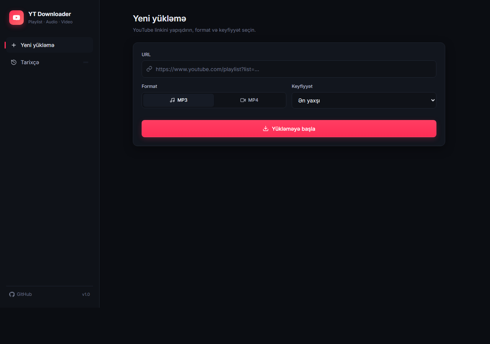
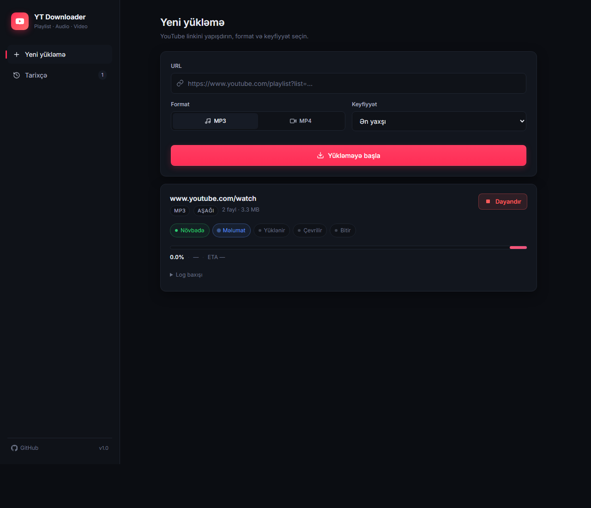
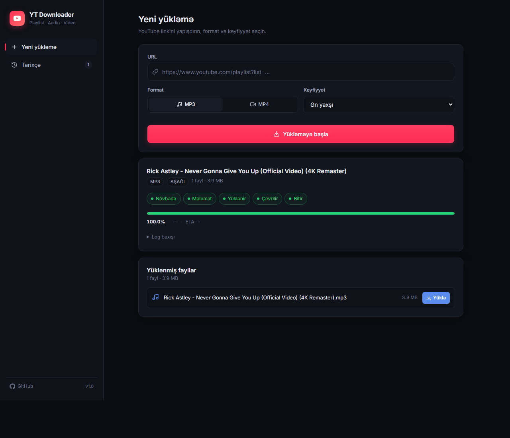
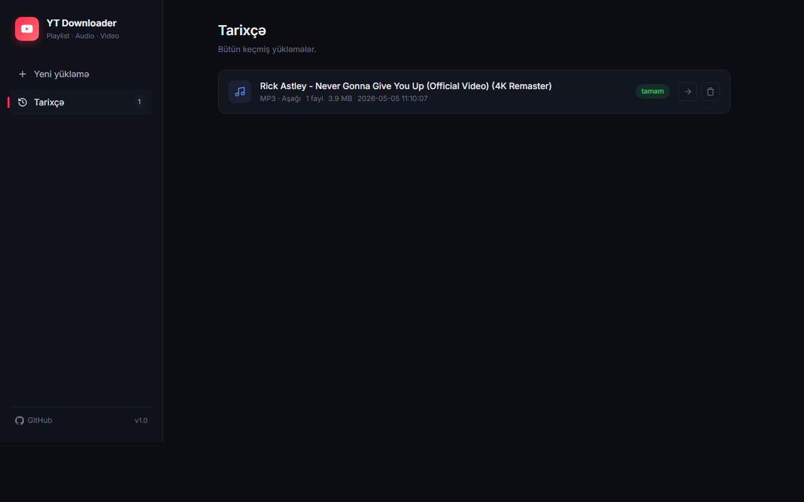
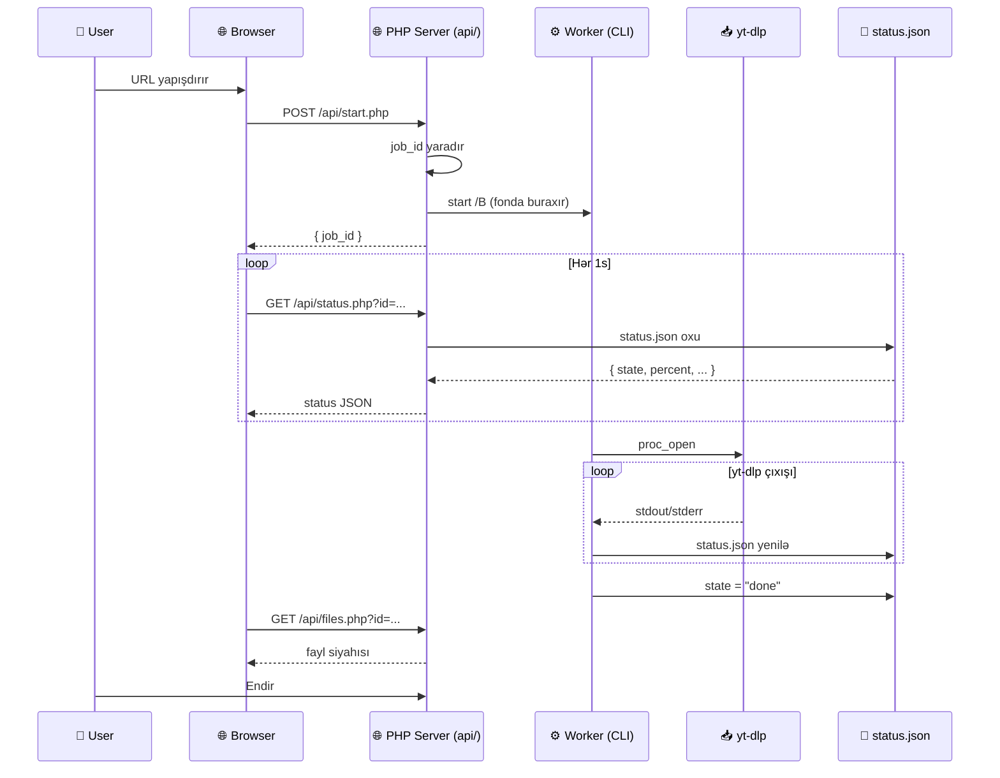

<div align="center">

# 🎬 YT Downloader

### YouTube playlist və video yükləyici — Core PHP backend, Vanilla JS frontend

[](https://www.php.net/)
[](https://github.com/yt-dlp/yt-dlp)
[](https://ffmpeg.org/)
[](LICENSE)
[](#)
[](https://kofe.al/@goshgarhasanov)

[**🚀 Başla**](#-i̇şə-salmaq) ·
[**📖 Sənəd**](#-mündəricat) ·
[**🐛 Bug**](https://github.com/goshgarhasanov/yt_playlist_php/issues) ·
[**⭐ Star**](https://github.com/goshgarhasanov/yt_playlist_php)

</div>

---

> **Sadə, peşəkar, framework-süz.** YouTube playlist və ya tək video linkini yapışdır, MP3 / MP4 yüklə. Real-time progress, job tarixçəsi, dayandırma — hamısı sırf core PHP + vanilla HTML/CSS/JS ilə.

---

## 🖼️ Ekran görüntüləri

<div align="center">

### 🏠 Yeni yükləmə formu


### ⚡ Aktiv yükləmə (real-time progress)


### ✅ Tamamlanmış yükləmə


### 📜 Tarixçə görünüşü


</div>

---

## 📑 Mündəricat

- [✨ Xüsusiyyətlər](#-xüsusiyyətlər)
- [📦 Tələblər](#-tələblər)
- [⚙️ Quraşdırma](#️-quraşdırma)
- [🚀 İşə salmaq](#-i̇şə-salmaq)
- [🎯 İstifadə](#-i̇stifadə)
- [🏗️ Quruluş](#️-layihə-quruluşu)
- [🔄 Necə işləyir](#-necə-i̇şləyir)
- [🌐 API endpoint-lər](#-api-endpoint-lər)
- [⚙️ Konfiqurasiya](#️-konfiqurasiya)
- [🛡️ Təhlükəsizlik](#️-təhlükəsizlik)
- [❓ FAQ](#-tez-tez-verilən-suallar)
- [📜 Lisenziya](#-lisenziya)

---

## ✨ Xüsusiyyətlər

| 🎵 | **Audio yükləmə** — MP3, thumbnail + metadata daxil olmaqla |
|---|---|
| 🎬 | **Video yükləmə** — MP4, ən yaxşı video + audio birləşməsi |
| 📃 | **Playlist dəstəyi** — bütün siyahını və ya tək videonu |
| ⚡ | **Real-time progress** — sürət, ETA, faiz, faza |
| 🛑 | **Stop / Cancel** — istənilən vaxt dayandır |
| 📜 | **Job tarixçəsi** — bütün keçmiş yükləmələr |
| 🎨 | **Modern UI** — dark theme, responsive, animasiyalı |
| 🔒 | **Təhlükəsiz** — path traversal qoruması, URL whitelist |
| 🪶 | **Yüngül** — heç bir framework, heç bir dependency manager |
| 🌐 | **Cross-platform** — Windows, macOS, Linux |

---

## 📦 Tələblər

| Komponent | Versiya | Yoxlama |
|-----------|---------|---------|
| 🐘 **PHP** | `8.1+` | `php -v` |
| 📥 **yt-dlp** | Son versiya | `yt-dlp --version` |
| 🎞️ **ffmpeg** | Stabil versiya | `ffmpeg -version` |

> ⚠️ Hər üç alət sistemin `PATH` mühit dəyişənində olmalıdır.

### 🪟 Windows

```powershell
winget install PHP.PHP
winget install Gyan.FFmpeg
pip install -U yt-dlp
```

### 🍎 macOS

```bash
brew install php yt-dlp ffmpeg
```

### 🐧 Linux (Debian / Ubuntu)

```bash
sudo apt install php-cli ffmpeg
sudo curl -L https://github.com/yt-dlp/yt-dlp/releases/latest/download/yt-dlp \
  -o /usr/local/bin/yt-dlp
sudo chmod a+rx /usr/local/bin/yt-dlp
```

---

## ⚙️ Quraşdırma

```bash
git clone https://github.com/goshgarhasanov/yt_playlist_php.git
cd yt_playlist_php
```

> 🎯 **Heç bir** `composer install`, `npm install`, build step yoxdur. Birbaşa işə sal.

---

## 🚀 İşə salmaq

<table>
<tr>
<td>

### 🪟 Windows

```bat
serve.bat
```

və ya

```bat
php -S localhost:8080
```

</td>
<td>

### 🍎 🐧 macOS / Linux

```bash
php -S localhost:8080
```

</td>
</tr>
</table>

Brauzerdə aç → **<http://localhost:8080>** 🎉

---

## 🎯 İstifadə

```
1️⃣  URL-i yapışdır
        ↓
2️⃣  Format seç (MP3 / MP4)
        ↓
3️⃣  Keyfiyyət seç
        ↓
4️⃣  "Yükləməyə başla" düyməsini bas
        ↓
5️⃣  Real-time progress-i izlə
        ↓
6️⃣  Tamamlanan faylları endir
```

### 📌 Dəstəklənən URL formatları

```
✅ https://www.youtube.com/playlist?list=PLxxxxx
✅ https://www.youtube.com/watch?v=xxxxx
✅ https://youtu.be/xxxxx
✅ https://music.youtube.com/playlist?list=xxxxx
```

### 🎚️ Keyfiyyət səviyyələri

| Səviyyə | MP3 | MP4 |
|---------|-----|-----|
| 🥇 **Ən yaxşı** | VBR ~245kbps | Ən yüksək mövcud |
| 🥈 **Orta** | ~192kbps | ≤ 720p |
| 🥉 **Aşağı** | ~128kbps | ≤ 480p |

---

## 🏗️ Layihə quruluşu

```
yt_playlist_php/
│
├── 📄 index.html            ← UI (sidebar + main view)
├── 🎨 assets/
│   ├── style.css            ← Dark theme tərzlər
│   └── app.js               ← Frontend məntiqi
│
├── 🌐 api/
│   ├── common.php           ← Köməkçi funksiyalar
│   ├── start.php            ← Yeni iş başladır
│   ├── status.php           ← Status / progress
│   ├── cancel.php           ← Yükləməni dayandır
│   ├── jobs.php             ← Bütün işlərin siyahısı
│   ├── delete.php           ← İşi və faylları sil
│   └── files.php            ← Faylları siyahıla / endir
│
├── ⚙️  worker.php           ← CLI işçi (yt-dlp wrapper)
│
├── 📁 jobs/<id>/
│   ├── config.json          ← URL, format, keyfiyyət
│   ├── status.json          ← Cari status
│   ├── yt.log               ← yt-dlp çıxışı
│   └── worker.log           ← İşçi log
│
└── 📥 downloads/<id>/
    └── *.mp3 / *.mp4
```

---

## 🔄 Necə işləyir



### 🧠 Detallı axın

1. 🎬 **Frontend** (`app.js`) → `FormData` ilə `api/start.php`-ə POST
2. ✅ **`start.php`** URL-i validate edir, `job_id` yaradır, `worker.php`-i fonda buraxır
3. 🔧 **`worker.php`** (CLI):
   - `yt-dlp` üçün arqumentləri qurur
   - `proc_open` ilə işə salır
   - `stdout`/`stderr`-i parse edir → `[download] X.X% of Y at Z ETA T`
   - `status.json` faylını ~400ms-də bir yeniləyir
4. 🔄 **Frontend polling** hər 1s-də progress soruşur
5. 📊 **Faza dəyişiklikləri**: `queued → fetching → downloading → converting → finalizing → done`
6. 📥 **Tamamlandıqda** `api/files.php`-dən siyahı və endirmə linkləri

---

## 🌐 API endpoint-lər

### 🟢 `POST /api/start.php`

Yeni yükləmə işi başladır.

**Body** *(form-data)*:

| Sahə | Tip | Tələb olunur | Default |
|------|-----|--------------|---------|
| `url` | string | ✅ | — |
| `format` | `mp3` \| `mp4` | ❌ | `mp3` |
| `quality` | `best` \| `medium` \| `low` | ❌ | `best` |

**Cavab**:
```json
{ "ok": true, "job_id": "a1b2c3d4e5f6a7b8" }
```

---

### 🔵 `GET /api/status.php?id=<job_id>`

Cari statusu qaytarır.

**Cavab**:
```json
{
  "ok": true,
  "state": "running",
  "phase": "downloading",
  "percent": 42.5,
  "current_item": 3,
  "total_items": 12,
  "speed": "1.20MiB/s",
  "eta": "00:14",
  "title": "Mahnı adı",
  "files_count": 2,
  "files_size": 8765432,
  "error": null,
  "log": "[download] 42.5% ..."
}
```

**Vəziyyətlər**: `queued` · `running` · `done` · `error` · `cancelled` · `unknown`

**Fazalar**: `queued` → `fetching` → `downloading` → `converting` → `finalizing` → `done`

---

### 🟠 `POST /api/cancel.php`

İşi dayandırır.

```bash
curl -X POST -d "id=<job_id>" http://localhost:8080/api/cancel.php
```

---

### 🟣 `GET /api/jobs.php`

Bütün işlərin siyahısı (tarixçə üçün).

```json
{
  "ok": true,
  "jobs": [
    {
      "job_id": "...", "state": "done", "title": "...",
      "format": "mp3", "files_count": 12, "files_size": 45678901,
      "started_at": "2026-05-05T...", "finished_at": "..."
    }
  ]
}
```

---

### 🔴 `POST /api/delete.php`

İşi və bütün fayllarını silir.

```bash
curl -X POST -d "id=<job_id>" http://localhost:8080/api/delete.php
```

---

### 🟡 `GET /api/files.php?id=<job_id>`

Yüklənmiş faylların siyahısı.

### `GET /api/files.php?id=<job_id>&download=<file>`

Faylı `application/octet-stream` kimi endirir.

---

## ⚙️ Konfiqurasiya

| Parametr | Yer | Default |
|----------|-----|---------|
| 🔌 Port | `serve.bat` | `8080` |
| 📝 Çıxış adı | `worker.php` | `%(playlist_index)03d - %(title)s.%(ext)s` |
| ⏱️ Polling intervalı | `assets/app.js` | `1000ms` |
| 💾 Status yenilənmə | `worker.php` | `400ms` |
| 📊 Log tail ölçüsü | `api/status.php` | `12288` bayt |

---

## 🛡️ Təhlükəsizlik

| Vektor | Qoruma |
|--------|--------|
| 🚫 **Path Traversal** | `realpath()` + base-directory prefix yoxlaması (separator daxil) |
| 🚫 **Command Injection** | URL whitelist + `escapeshellarg` (Unix) / quote escape (Windows) |
| 🚫 **SSRF** | Yalnız `youtube.com` / `youtu.be` / `music.youtube.com` qəbul olunur |
| 🚫 **XSS** | `textContent` istifadəsi, `escapeHtml()` history render-də |
| 🚫 **Job ID injection** | `[a-z0-9]{8,32}` regex ilə validation |
| 🚫 **Atomic writes** | `status.json` tmp + rename pattern ilə yazılır |
| 🚫 **Symlink trick** | `realpath` istifadəsi (symlink resolve edir) |

> ⚠️ **Diqqət**: Bu layihə **yerli istifadə** üçün dizayn olunub. PHP CLI server `localhost`-a bind olur. İnternetə açacaqsanızsa, ən azı:
> - 🔐 Authentication
> - 🛂 CSRF token
> - 📊 Rate limiting
> - 🔒 HTTPS
> əlavə edin.

---

## ❓ Tez-tez verilən suallar

<details>
<summary><strong>🔧 yt-dlp tapılmadı xətası</strong></summary>

`where yt-dlp` (Windows) və ya `which yt-dlp` (macOS/Linux) yoxlayın. Boş çıxırsa, `PATH`-da deyil. Yenidən quraşdırın.
</details>

<details>
<summary><strong>🎵 MP3 yüklənmir, .webm qalır</strong></summary>

`ffmpeg` quraşdırılmayıb. yt-dlp audio çevrilməsi üçün ona ehtiyac duyur.
</details>

<details>
<summary><strong>📊 Progress bar 0%-də qalır</strong></summary>

- Brauzer Console-da (F12) şəbəkə xətası varmı?
- `jobs/<id>/yt.log` faylına bax — yt-dlp nə yazır?
- Bəzi videolar (yaş limit, region kilidi) yüklənə bilməz, amma playlist davam edir.
</details>

<details>
<summary><strong>⏱️ Çox böyük playlist üçün vaxt bitir?</strong></summary>

Worker prosesi web server-dən asılı deyil. Brauzeri bağlasanız belə, yenidən açıb eyni `?job=<id>` URL-i ilə davam edə bilərsiniz.
</details>

<details>
<summary><strong>🔢 Eyni anda neçə iş işlədə bilərəm?</strong></summary>

Limit yoxdur. Hər iş ayrıca CLI prosesdir. Praktik olaraq internet sürəti və CPU bottleneck olur.
</details>

<details>
<summary><strong>🌍 YouTube xaricindəki saytlar?</strong></summary>

`yt-dlp` 1000+ saytı dəstəkləyir, lakin bu UI-da `start.php`-də whitelist var. Genişləndirmək üçün `parse_url` yoxlamasını dəyişdirin.
</details>

---

## 📜 Lisenziya

[MIT](LICENSE) — istədiyin kimi istifadə et, dəyişdir, paylaş 🎉

`yt-dlp` və `ffmpeg` öz lisenziyaları altındadır.

---

<div align="center">

**Faydalı oldusa ⭐ ver!**

Sual / problem / təklif → [GitHub Issues](https://github.com/goshgarhasanov/yt_playlist_php/issues)

[⬆ Yuxarı qayıt](#-yt-downloader)

</div>
